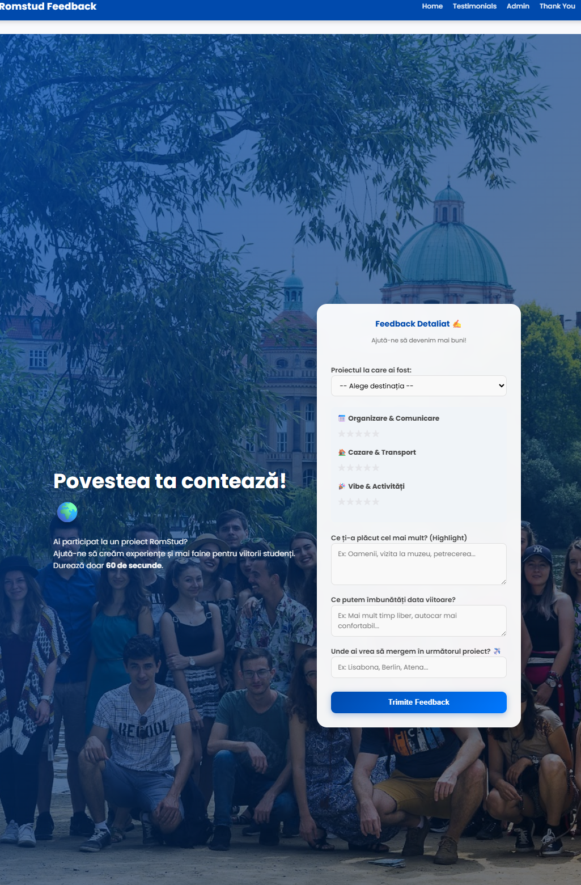
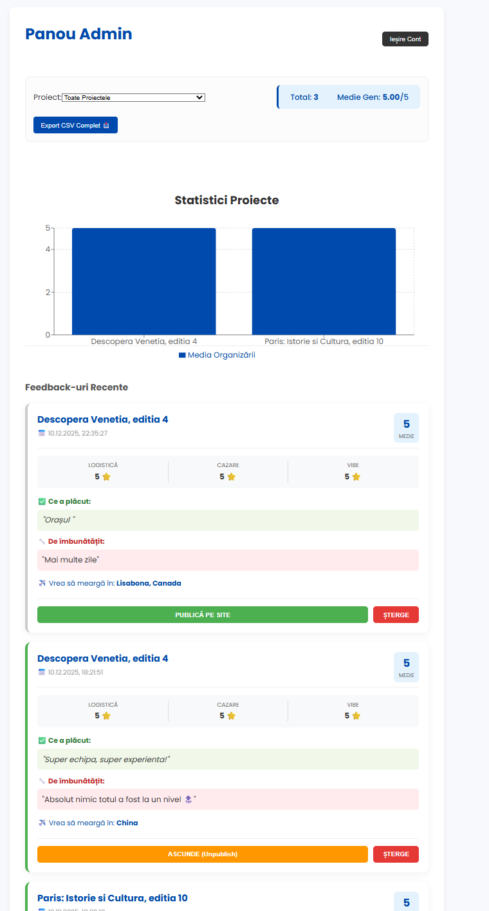

# 🌍 RomStud Feedback & Rating Tool

 

A modern, full-stack feedback collection platform built for **RomStud**, a student organization specializing in cultural travel projects across Europe. This application digitizes the feedback process, transforming it from tedious forms into an engaging, interactive experience, while providing organizers with a powerful dashboard for data analysis.

🔗 **Live Demo:** [https://romstud-feedback.netlify.app/]

---

## 📸 Screenshots

Here is a preview of the application:

### The Student View (Home)



### The Organizer View (Admin)

## 

## 🚀 The Problem & Solution

**The Challenge:**
Collecting feedback after large-scale student trips was often disorganized, relying on manual forms or basic surveys that lacked engagement and data visualization.

**The Solution:**
I built a custom Single Page Application (SPA) that serves two main purposes:

1.  **For Participants:** A gamified, "Glassmorphism" design interface to submit ratings (Organization, Vibe, Accommodation) and detailed reviews instantly.
2.  **For Organizers:** A secure Admin Panel to visualize data, moderate content, and export reports for future planning.

---

## ✨ Key Features

### 👤 User Interface (Client Side)

-   **Interactive Rating System:** Custom star-rating components for granular feedback (Organization, Vibe, Logistics).
-   **Gamification:** Confetti animations upon successful submission to boost user satisfaction.
-   **Responsive Design:** Fully optimized for mobile devices (iPhone/Android) using modern CSS Grid and Flexbox layouts.
-   **Dynamic Media Gallery:** A curated list of external project links (Vlogs, Albums, Aftermovies) with dynamic thumbnails.

### 🛡️ Admin Dashboard (Protected)

-   **Secure Authentication:** Firebase Auth (Email/Password) to protect sensitive data.
-   **Real-time Analytics:** Visual charts (using `Recharts`) displaying participation trends and average scores per project.
-   **Content Moderation:** Approval system (Publish/Hide) to control which testimonials appear on the public site.
-   **Data Management:** Full CRUD capabilities (Create, Read, Update, Delete) and **CSV Export** for offline reporting.

---

## 🛠️ Tech Stack

-   **Frontend:** React.js, Vite
-   **Styling:** Pure CSS3 (Custom Glassmorphism UI, Responsive Grid), Google Fonts (Poppins)
-   **Backend / Database:** Google Firebase (Firestore NoSQL Database)
-   **Authentication:** Firebase Auth
-   **Routing:** React Router v6 (Protected Routes implementation)
-   **Deployment:** Netlify (CI/CD connected to GitHub)

---

## ⚙️ Installation & Setup

If you want to run this project locally:

1.  **Clone the repository**

    ```bash
    git clone [https://github.com/MihailNegulet/romstud-feedback-tool.git](https://github.com/MihailNegulet/romstud-feedback-tool.git)
    cd romstud-feedback-tool
    ```

2.  **Install dependencies**

    ```bash
    npm install
    ```

3.  **Configure Firebase**

    -   Create a project at [Firebase Console](https://console.firebase.google.com/).
    -   Create a `.env` file in the root directory.
    -   Add your Firebase configuration keys (VITE_API_KEY, etc.).

4.  **Run the application**
    ```bash
    npm run dev
    ```

---

## 💡 What I Learned

Building this project helped me solidify my skills in:

-   **State Management:** Handling complex form states and synchronizing them with a cloud database.
-   **Security Patterns:** Implementing Protected Routes and Firebase Security Rules to prevent unauthorized access.
-   **UI/UX Design:** Creating a polished "Glassmorphism" aesthetic manually with CSS (backdrop-filter, rgba colors) and ensuring perfect responsiveness on all viewports.
-   **Data Visualization:** Transforming raw data into meaningful insights using charts.

---

## 📬 Contact

**[Mihail Negulet]** - Frontend / Full-Stack Developer

-   
-   
